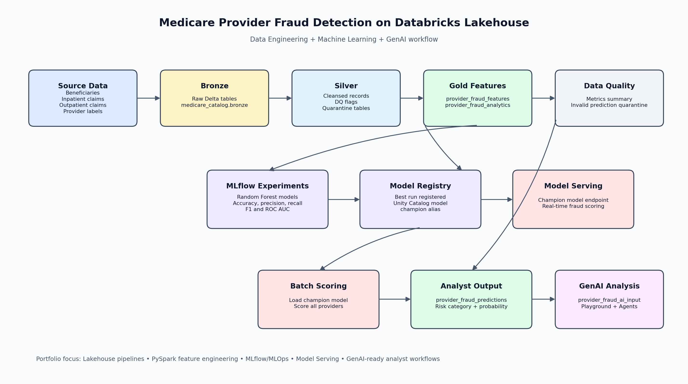
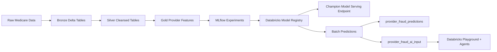

# Medicare Provider Fraud Detection on Databricks Lakehouse

End-to-end Data Engineering, Machine Learning, and GenAI project for detecting high-risk Medicare providers using a Databricks Lakehouse architecture.

This repository demonstrates how raw Medicare claims and provider-label data can be transformed into governed provider-level features, used to train a fraud detection model, deployed through Databricks Model Serving, and extended with LLM-ready investigation context for analyst workflows.

## Business Problem

Healthcare fraud creates financial loss, operational waste, and risk for payers and public healthcare programs. Manual review teams need a scalable way to prioritize providers whose claim patterns look unusual, especially when working across inpatient, outpatient, beneficiary, reimbursement, and chronic-condition data.

The goal of this project is to create a provider-level fraud detection pipeline that:

- Consolidates Medicare beneficiary, inpatient, outpatient, and provider label data.
- Engineers provider-level behavioral and reimbursement features.
- Trains and tracks fraud models with reproducible MLflow experiments.
- Registers the best-performing model for governed deployment.
- Scores providers in batch and creates analyst-ready risk outputs.
- Prepares structured provider context for GenAI-assisted fraud explanation.

## Solution Overview

The project uses a Bronze → Silver → Gold Lakehouse design in Databricks:

- **Bronze:** Raw source tables are organized in `medicare_catalog.bronze`.
- **Silver:** Beneficiary, inpatient, outpatient, unified claims, and provider label tables are cleaned, typed, deduplicated, and quality-checked.
- **Gold:** Provider-level fraud features, analytics tables, model feature importance, batch predictions, and LLM-ready prompts are created for analysts and ML workflows.
- **ML:** Random Forest classifiers are trained using provider fraud features, tracked in MLflow, and selected by ROC AUC.
- **MLOps:** The best model is registered in Databricks Model Registry with a `champion` alias and used by batch scoring and serving workflows.
- **GenAI:** Provider risk context is written to `provider_fraud_ai_input` so analysts can test LLM explanations in Databricks Playground and explore AI application patterns with Databricks Agents.

## Architecture





## Databricks Technologies Used

- Databricks Lakehouse Platform
- Unity Catalog catalogs and schemas
- Delta Lake managed tables
- PySpark DataFrame transformations
- Databricks notebooks exported as source-controlled Python files
- MLflow Experiments
- MLflow model signatures and input examples
- Databricks Model Registry
- Registered model aliases using `champion`
- Databricks Model Serving endpoint pattern
- Databricks SQL for analyst queries
- Databricks Playground for LLM workflow testing
- Databricks Agents / AI application exploration

## Repository Structure

```text
medicare-provider-fraud-detection/
├── README.md
├── requirements.txt
├── .gitignore
├── notebooks/
│   ├── 01_bronze_ingestion.py
│   ├── 02_feature_engineering.py
│   ├── 08_data_quality_framework.py
│   ├── 09_model_training_experiments.py
│   └── 10_batch_predictions_for_analysts.py
├── sql/
│   ├── create_tables.sql
│   └── fraud_queries.sql
├── docs/
│   ├── architecture.md
│   └── project_story.md
├── screenshots/
└── architecture/
    └── architecture_diagram.png
```

## Notebook Workflow

Run the notebooks in this order inside Databricks:

1. `notebooks/01_bronze_ingestion.py`
   - Creates `bronze`, `silver`, `gold`, and `monitoring` schemas.
   - Validates access to raw Medicare source tables.

2. `notebooks/02_feature_engineering.py`
   - Cleans beneficiary, inpatient, outpatient, unified claims, and provider label data.
   - Writes Silver Delta tables and quarantine tables.
   - Builds `medicare_catalog.gold.provider_fraud_features`.
   - Creates analyst-friendly `provider_fraud_analytics`.

3. `notebooks/08_data_quality_framework.py`
   - Runs reusable data quality checks for features and predictions.
   - Writes metrics to `medicare_catalog.quality.data_quality_metrics`.
   - Creates quarantine outputs and DQ dashboard summary tables.

4. `notebooks/09_model_training_experiments.py`
   - Trains Random Forest fraud models.
   - Logs parameters, metrics, signatures, and artifacts to MLflow.
   - Selects the best run by ROC AUC.
   - Registers the best model as `medicare_catalog.gold.medicare_provider_fraud_model`.
   - Assigns the registered model alias `champion`.

5. `notebooks/10_batch_predictions_for_analysts.py`
   - Loads the `champion` model from Databricks Model Registry.
   - Scores provider-level features in batch.
   - Writes `medicare_catalog.gold.provider_fraud_predictions`.
   - Creates `medicare_catalog.gold.provider_fraud_ai_input` for LLM analysis.

## Core Tables

| Layer | Table | Purpose |
|---|---|---|
| Bronze | `medicare_catalog.bronze.beneficiarydata` | Raw beneficiary profile data |
| Bronze | `medicare_catalog.bronze.inpatientdata` | Raw inpatient claims |
| Bronze | `medicare_catalog.bronze.outpatientdata` | Raw outpatient claims |
| Bronze | `medicare_catalog.bronze.provider` | Provider fraud labels |
| Silver | `medicare_catalog.silver.beneficiary` | Cleaned beneficiary records |
| Silver | `medicare_catalog.silver.inpatient_claims` | Cleaned inpatient claims |
| Silver | `medicare_catalog.silver.outpatient_claims` | Cleaned outpatient claims |
| Silver | `medicare_catalog.silver.unified_claims` | Combined inpatient and outpatient claims |
| Silver | `medicare_catalog.silver.provider_labels` | Provider-level fraud labels |
| Gold | `medicare_catalog.gold.provider_fraud_features` | ML-ready provider features |
| Gold | `medicare_catalog.gold.provider_fraud_predictions` | Batch scoring output for analysts |
| Gold | `medicare_catalog.gold.provider_fraud_ai_input` | LLM-ready investigation prompts |
| Quality | `medicare_catalog.quality.data_quality_metrics` | Feature and prediction DQ metrics |

## Feature Engineering

The Gold feature set is aggregated at the provider level and includes:

- Claim volume: `total_claims`, `unique_beneficiaries`, `claims_per_beneficiary`
- Claim mix: `inpatient_claims`, `outpatient_claims`, `inpatient_claim_ratio`, `outpatient_claim_ratio`
- Reimbursement behavior: average, total, and maximum reimbursement amount
- Deductible behavior: average and total deductible amount
- Time-based metrics: average claim duration and hospital stay
- Risk indicators: high reimbursement claim counts and ratios
- Clinical context: chronic condition claim counts and ratios
- Target label: `fraud_label`

## Machine Learning and MLflow

The modeling notebook trains Random Forest classifiers using provider-level features from `provider_fraud_features`.

Tracked MLflow assets include:

- Model hyperparameters such as estimator count, max depth, class weighting, and model type
- Evaluation metrics: accuracy, precision, recall, F1 score, and ROC AUC
- Model signatures inferred from the training data
- Input examples for reproducible serving
- Feature importance outputs written to `medicare_catalog.gold.model_feature_importance`

The best run is selected by ROC AUC and registered as:

```text
medicare_catalog.gold.medicare_provider_fraud_model
```

The registered version is tagged with project metadata and assigned the `champion` alias for downstream scoring.

## Model Registry and Serving Endpoint

The project uses Databricks Model Registry to promote the best model into a governed lifecycle. The production pattern is:

1. Train candidate models in MLflow Experiments.
2. Select the best run by ROC AUC.
3. Register the model in Unity Catalog.
4. Set the `champion` alias on the selected model version.
5. Deploy the champion version to a Databricks Model Serving endpoint.
6. Use the serving endpoint for real-time fraud risk scoring use cases.
7. Use the same champion model URI for batch scoring consistency.

Batch scoring uses:

```python
model_uri = "models:/medicare_catalog.gold.medicare_provider_fraud_model@champion"
```

## Batch Predictions for Analysts

The batch scoring notebook writes:

```text
medicare_catalog.gold.provider_fraud_predictions
```

Each scored provider includes:

- Predicted fraud label
- Fraud probability
- Risk category: `High Risk`, `Medium Risk`, or `Low Risk`
- Provider feature context for analyst review
- Prediction timestamp

The SQL file `sql/fraud_queries.sql` contains analyst-ready queries for high-risk provider triage, top suspicious providers, actual-vs-predicted comparisons, and data quality review.

## GenAI, Playground, and Agents

The project creates:

```text
medicare_catalog.gold.provider_fraud_ai_input
```

This table converts model outputs and provider features into structured fraud analysis prompts. The prompts are designed for Databricks Playground testing and future AI application patterns using Databricks Agents.

Example analyst use cases:

- Summarize why a provider was marked high risk.
- Explain which reimbursement and claim-volume patterns are unusual.
- Generate investigation notes for audit teams.
- Compare model-driven risk with data quality signals.
- Prototype an Agent that retrieves provider features, predictions, and supporting evidence before generating a concise fraud risk explanation.

## Setup Instructions

### Prerequisites

- Databricks workspace with Unity Catalog enabled
- Catalog named `medicare_catalog`
- Source Medicare tables available in `medicare_catalog.bronze`
- Cluster or SQL warehouse with access to Delta tables
- Databricks Runtime with PySpark, MLflow, scikit-learn, and pandas
- Permissions to create schemas, tables, MLflow experiments, registered models, and serving endpoints

### Local Setup

Clone the repository and install Python dependencies for local linting or lightweight review:

```bash
python -m venv .venv
source .venv/bin/activate
pip install -r requirements.txt
```

### Databricks Setup

1. Import the files in `notebooks/` into a Databricks workspace or sync the repository with Databricks Repos.
2. Confirm that `medicare_catalog.bronze.beneficiarydata`, `inpatientdata`, `outpatientdata`, and `provider` are available.
3. Run notebooks in the documented order.
4. Review MLflow runs under `/Shared/medicare_provider_fraud_experiment`.
5. Confirm the registered model exists at `medicare_catalog.gold.medicare_provider_fraud_model`.
6. Create or update a Databricks Model Serving endpoint using the `champion` model alias.
7. Use `sql/fraud_queries.sql` to validate analyst-facing outputs.

## GitHub Push Commands

```bash
git init
git add .
git commit -m "Initial commit"
git branch -M main
git remote add origin <repo_url>
git push -u origin main
```

## Data Bricks and Data Quality

This project is designed to demonstrate skills relevant to Data Engineer and ML Engineer roles:

- Lakehouse data modeling with Bronze, Silver, and Gold layers
- PySpark feature engineering at provider level
- Delta Lake table design and quality monitoring
- Fraud detection feature design for healthcare claims
- MLflow experiment tracking and model selection
- Model Registry promotion using aliases
- Batch scoring workflows for business analysts
- Model Serving deployment pattern
- GenAI prompt preparation for fraud investigation workflows
- Practical SQL for stakeholder-facing fraud analytics
