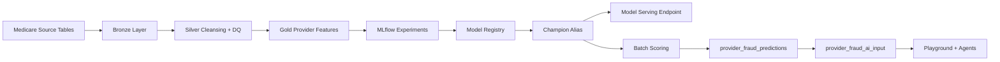

# Architecture

This project implements a Databricks Lakehouse architecture for Medicare provider fraud detection. The design separates raw data management, cleansing, feature engineering, machine learning, model operations, and GenAI-assisted analysis into clearly governed layers.

## High-Level Flow



## Data Architecture

### Bronze Layer

The Bronze layer stores raw Medicare source tables in Unity Catalog:

- `medicare_catalog.bronze.beneficiarydata`
- `medicare_catalog.bronze.inpatientdata`
- `medicare_catalog.bronze.outpatientdata`
- `medicare_catalog.bronze.provider`

This layer preserves the original source structure and provides the starting point for validation, cleansing, and enrichment.

### Silver Layer

The Silver layer standardizes data for reliable downstream analytics and model training.

Silver processing includes:

- Duplicate removal using business keys such as `BeneID`, `ClaimID`, and `Provider`
- Date parsing for claim, admission, discharge, birth, and death dates
- Numeric casting for reimbursement and deductible fields
- Derived claim-duration and hospital-stay features
- Gender, race, deceased-status, and age derivations
- Fraud label conversion from `PotentialFraud` into binary `fraud_label`
- Quarantine tables for invalid records
- Data quality metrics written to monitoring tables

Key Silver tables:

- `medicare_catalog.silver.beneficiary`
- `medicare_catalog.silver.inpatient_claims`
- `medicare_catalog.silver.outpatient_claims`
- `medicare_catalog.silver.unified_claims`
- `medicare_catalog.silver.provider_labels`

### Gold Layer

The Gold layer is optimized for fraud analytics, ML training, and investigation workflows.

The primary ML feature table is:

```text
medicare_catalog.gold.provider_fraud_features
```

Provider-level features are created by joining unified claims with beneficiary data and provider labels, then aggregating at the `Provider` grain.

The table includes claim volume, claim mix, reimbursement behavior, deductible behavior, claim duration, hospital stay, chronic-condition indicators, high-reimbursement indicators, ratio features, and the target `fraud_label`.

Additional Gold outputs:

- `medicare_catalog.gold.provider_fraud_analytics`
- `medicare_catalog.gold.model_feature_importance`
- `medicare_catalog.gold.provider_fraud_predictions`
- `medicare_catalog.gold.provider_fraud_ai_input`

## Data Quality Architecture

Data quality is implemented at two points:

1. **Layer-specific checks during transformation**
   - Missing IDs
   - Invalid dates
   - Negative reimbursement values
   - Invalid labels
   - Duplicate key removal
   - Invalid claim durations

2. **Reusable framework checks**
   - Primary key duplication
   - Required column null checks
   - Non-negative numeric checks
   - Ratio columns constrained between 0 and 1
   - Prediction quarantine for invalid scoring records

Quality metrics are stored in:

```text
medicare_catalog.quality.data_quality_metrics
medicare_catalog.quality.dq_dashboard_summary
```

The notebook also writes invalid prediction records to:

```text
medicare_catalog.quality.quarantine_provider_fraud_predictions
```

## Machine Learning Architecture

The ML workflow uses `provider_fraud_features` as the training source.

Modeling flow:

1. Select ML feature columns and the `fraud_label` target.
2. Convert the Spark DataFrame to pandas for scikit-learn training.
3. Create stratified train/test splits.
4. Train Random Forest model candidates.
5. Track parameters, metrics, artifacts, signatures, and input examples in MLflow.
6. Select the best run by ROC AUC.
7. Register the best model in Unity Catalog.
8. Assign the `champion` alias for production scoring.

Registered model:

```text
medicare_catalog.gold.medicare_provider_fraud_model
```

Champion model URI:

```text
models:/medicare_catalog.gold.medicare_provider_fraud_model@champion
```

## Serving Architecture

The project follows a Databricks Model Serving pattern:

- The registered `champion` model is the single source of truth for deployment.
- The same champion model URI can be used for batch scoring and serving endpoint deployment.
- A Databricks Model Serving endpoint can expose provider fraud probabilities for real-time applications, dashboards, or analyst tools.

Recommended serving request payloads should contain the same feature columns used during training:

- `total_claims`
- `unique_beneficiaries`
- `inpatient_claims`
- `outpatient_claims`
- `avg_reimbursement_amount`
- `total_reimbursement_amount`
- `max_reimbursement_amount`
- `avg_deductible_amount`
- `total_deductible_amount`
- `avg_claim_duration_days`
- `avg_hospital_stay_days`
- `high_reimbursement_claims`
- `chronic_condition_claims`
- `inpatient_claim_ratio`
- `outpatient_claim_ratio`
- `high_reimbursement_claim_ratio`
- `chronic_condition_claim_ratio`
- `claims_per_beneficiary`

## GenAI Architecture

The GenAI workflow begins after model scoring.

The table:

```text
medicare_catalog.gold.provider_fraud_ai_input
```

contains provider-level prediction context and a generated `fraud_analysis_prompt`.

This design allows analysts to test LLM workflows in Databricks Playground before moving toward a production AI application.

Potential Agent architecture:

1. User asks for a provider risk explanation.
2. Agent retrieves provider prediction and feature context.
3. Agent optionally retrieves data quality metrics or feature importance.
4. Agent generates a concise fraud risk explanation.
5. Analyst reviews the result and decides whether to escalate investigation.

## Operational Considerations

- Use Databricks Jobs to schedule notebooks in dependency order.
- Use Unity Catalog permissions to protect source, feature, prediction, and model assets.
- Track data quality metrics over time to detect source drift and scoring anomalies.
- Promote model versions through aliases instead of hard-coded model version numbers.
- Keep `provider_fraud_ai_input` grounded in structured model outputs to reduce unsupported LLM explanations.
